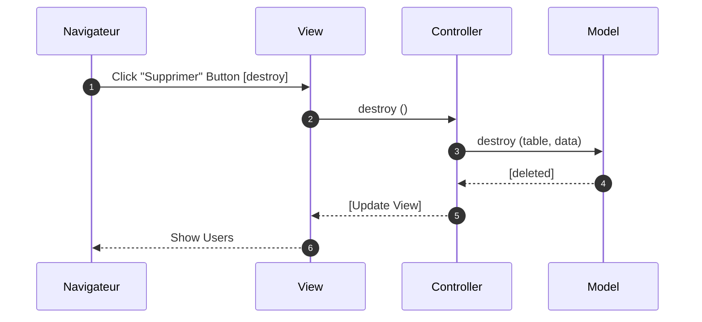
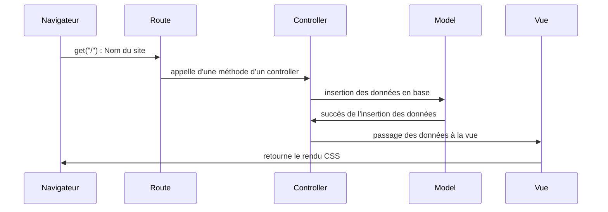
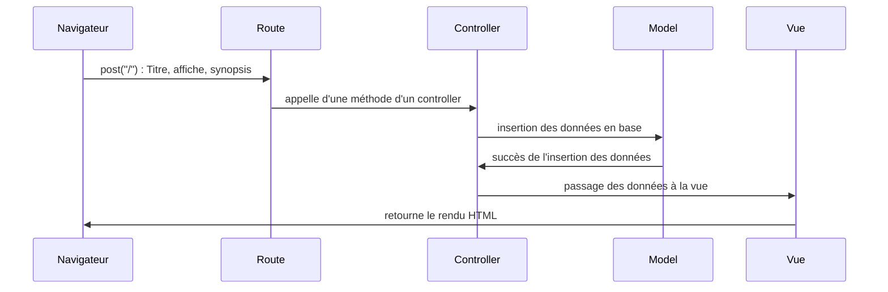
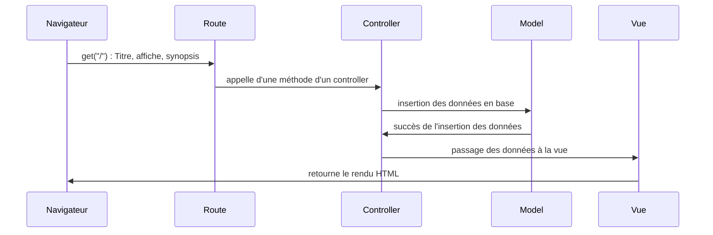
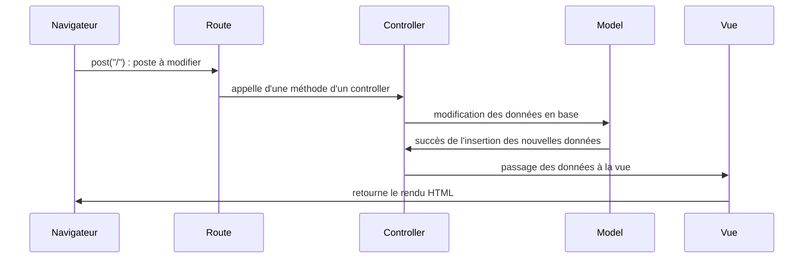
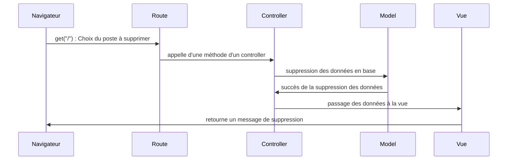

SPRINT	 07 
=======
Site 100% Laravel


## Visualiser le site
Pour pouvoir visualiser notre site: [Zanbob](perianmodely-julie.sprint-07-laravel.sc1lgvu9627.universe.wf)
 
## La maquette
Lien Figma pour visualiser la maquette: [maquette du site Zanbob](https://www.figma.com/file/yR2h3PDxzq1M5XaEb40ffH/Maquette-sprint-07?node-id=0%3A1)


# Diagrammes de séquence UML

## Séquence Ajout de Film


## Séquence Suppression de Film 


## Séquence Authentification

```mermaid
sequenceDiagram
    autonumber
    Navigateur->>Controller: http Request (login_data) 
    Controller->>Model: request AUTH (login_data) 
    Model->>Controller: return logvalid 

     alt 
     
     
     
     
     Wireframe du site : https://www.figma.com/file/LUPdLjdUROYCjkWCUlVd4f/Sprint_07?node-id=0%3A1


# Création d'un poste

```mermaid
sequenceDiagram
participant Navigateur
participant Route
participant Controller
participant Model
participant Vue

Navigateur->>Route: post('/') data : Titre, affiche, synopsis
Route->>Controller: appel d'une méthode d'un contrôleur
Controller->>Model: insertion des données en base
Model->>Controller: succès de l'insertion des données
Controller->>Vue: passage des données à la vue
Vue->>Navigateur: retourne le rendu HTML
```

# Acces page d'accueil


# Création d'un poste


# Lecture d'un poste


# Modification d'un poste


# Suppression d'un poste



    Controller-->>View: [Update show (sucess)] 
    View-->>Controller: [Update show ()] 
    Controller-->>Navigateur: http Response 

    Controller-->>View: [Update show (fail)] 
    View-->>Controller: [Update show ()] 
    Controller-->>Navigateur: http Response
    end
```
