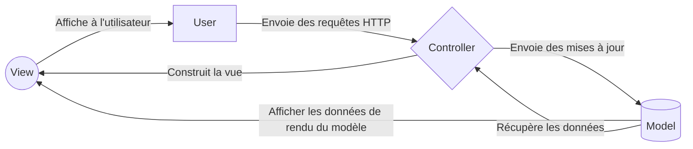
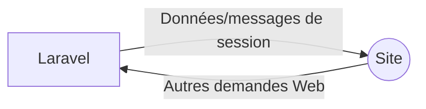

lien figma pour les maquettes https://www.figma.com/file/yR2h3PDxzq1M5XaEb40ffH/Maquette-sprint-07?node-id=0%3A1

```mermaid
graph LR
B((View)) -- Affiche à l'utilisateur --> A[User]
A -- Envoie des requêtes HTTP --> C{Controller}
D[(Model)] -- Afficher les données de rendu du modèle --> B
C -- Envoie des mises à jour --> D
D -- Récupère les données --> C
C -- Construit la vue --> B
```

```mermaid
graph LR
A[Laravel] -- Données/messages de session --> B((Site))
B((Site)) -- Autres demandes Web -->A[Laravel]
```
