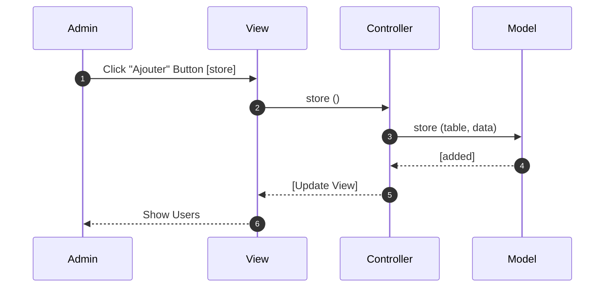
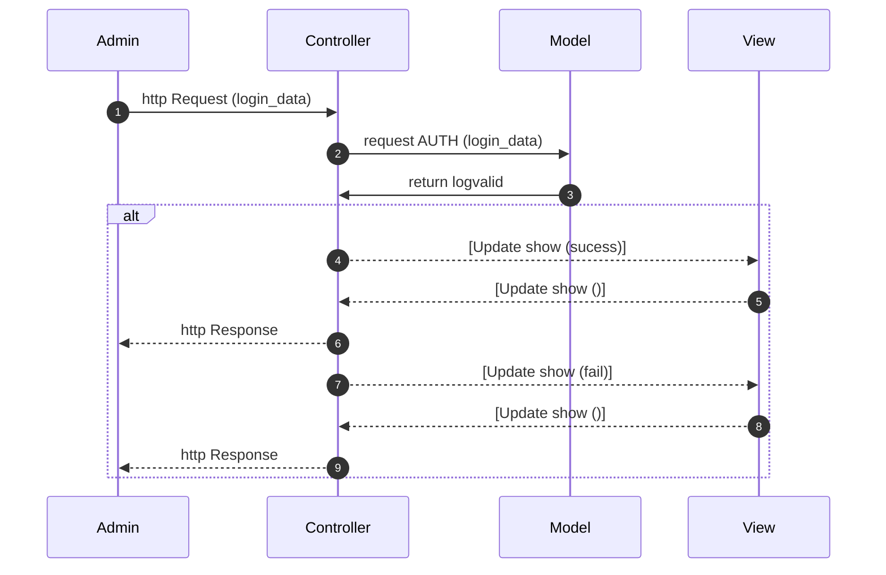

SPRINT	 07 
=======
Site 100% Laravel

## Visualiser le site
Pour pouvoir visualiser notre site: [Zanbob](perianmodely-julie.sprint-07-laravel.sc1lgvu9627.universe.wf)
 
## La maquette
Lien Figma pour visualiser la maquette: [maquette du site Zanbob](https://www.figma.com/file/yR2h3PDxzq1M5XaEb40ffH/Maquette-sprint-07?node-id=0%3A1)

# Diagrammes de séquence UML

## Séquence Ajout de Film

## Séquence Suppression de Film 

## Séquence Authentification

