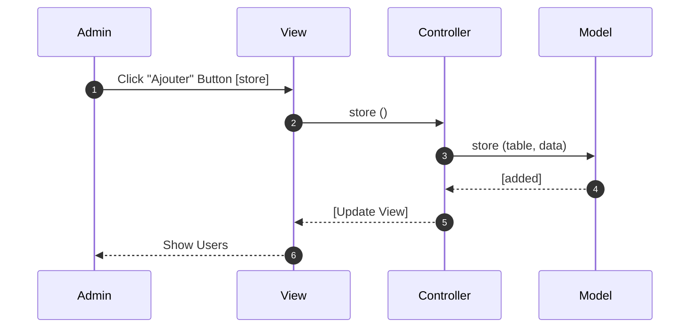
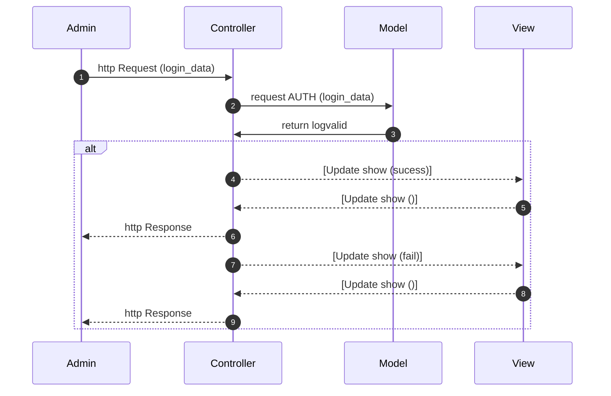

#Sprint 07

lien figma pour les maquettes https://www.figma.com/file/yR2h3PDxzq1M5XaEb40ffH/Maquette-sprint-07?node-id=0%3A1
=======

# Diagrammes de séquence UML

## Sequence Ajout de Film

## Sequence Suppression de Film 

## Sequence Authentification

    
